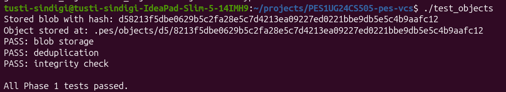
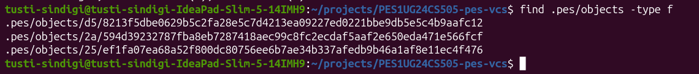
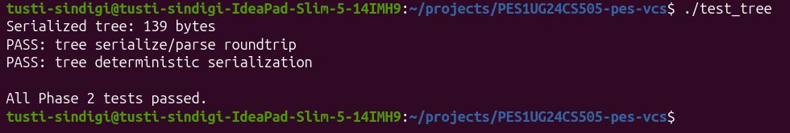
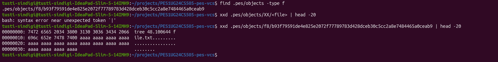
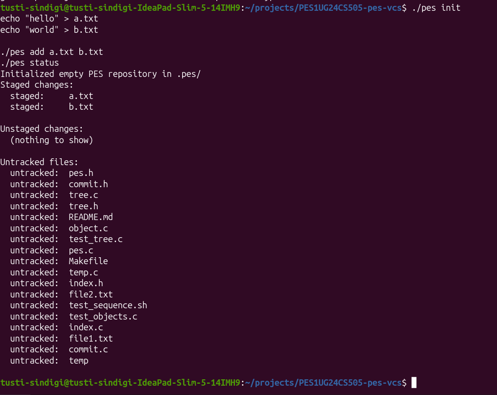
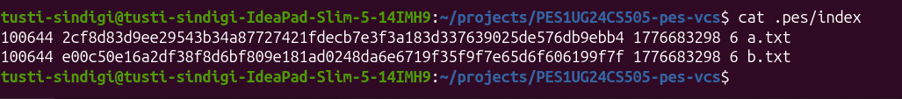
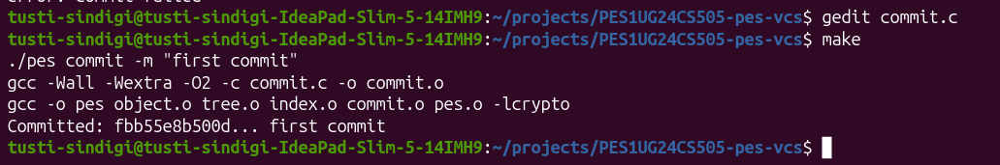

# Building PES-VCS — A Version Control System from Scratch

**Objective:** Build a local version control system that tracks file changes, stores snapshots efficiently, and supports commit history.

**Platform:** Ubuntu 22.04

---

## Screenshots

### Phase 1




### Phase 2




### Phase 3




### Phase 4



---

## Commands Implemented

```bash
pes init              # Initialize repository
pes add <file>        # Stage files
pes status            # Show file status
pes commit -m <msg>   # Commit changes
pes log               # Show history
```

---

##  Phase 5: Branching and Checkout

### Q5.1 — How checkout works

To implement `pes checkout <branch>`:

1. Verify branch exists in `.pes/refs/heads/`
2. Update `.pes/HEAD`:

   ```
   ref: refs/heads/<branch>
   ```
3. Read commit hash from branch
4. Load commit → extract tree
5. Rebuild working directory from tree
6. Update `.pes/index`

#### Why complex?

* Requires recursive tree traversal
* Must overwrite files safely
* Must avoid losing uncommitted work
* Needs synchronization between index and working directory

---

### Q5.2 — Detecting dirty working directory

A directory is **dirty** if it differs from index.

#### Detection:

* Compare file metadata (mtime, size)
* If mismatch → modified

Optional:

* Recompute hash

#### Conflict condition:

If:

* File modified locally
  AND
* File differs in target branch

Abort checkout

---

### Q5.3 — Detached HEAD

Detached HEAD:

```
HEAD → commit hash
```

#### Behavior:

* Commits are created
* No branch points to them
* Risk of losing commits

#### Recovery:

```bash
git branch new-branch
```

---

## Phase 6: Garbage Collection

### Q6.1 — Finding unreachable objects

#### Algorithm: Mark & Sweep

**Mark Phase**

* Start from branch heads
* Traverse commits → trees → blobs
* Store hashes in a hash set

**Sweep Phase**

* Traverse `.pes/objects`
* Delete unmarked objects

#### Data structure:

* Hash set (fast lookup)

#### Complexity:

* Up to millions of objects in worst case

---

### Q6.2 — GC vs Commit race condition

#### Problem:

1. Commit creates objects
2. GC runs simultaneously
3. GC deletes "unreachable" objects
4. Commit references deleted object → corruption

---

#### Solution (Git):

* Locking
* Grace period
* Safe write ordering
* Pack files

---

## Features Implemented

* Content-addressable object storage
* Tree-based directory structure
* Index (staging area)
* Commit creation and history
* Status tracking

---

## How to Run

```bash
make
./pes init
./pes add file1.txt
./pes commit -m "first commit"
./pes log
```

---

##  Project Structure

```
.pes/
├── objects/
├── refs/
│   └── heads/
│       └── main
├── index
└── HEAD
```

## Project Report

[Report](./report.pdf)
